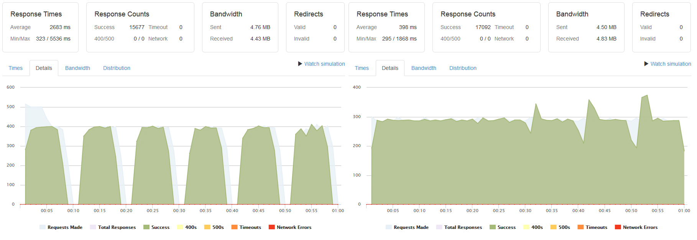
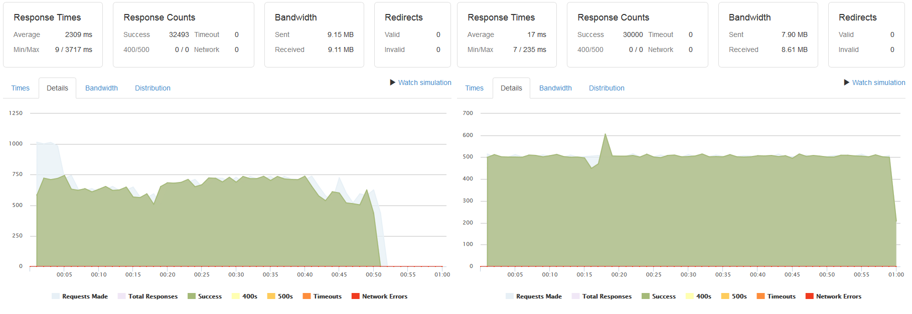
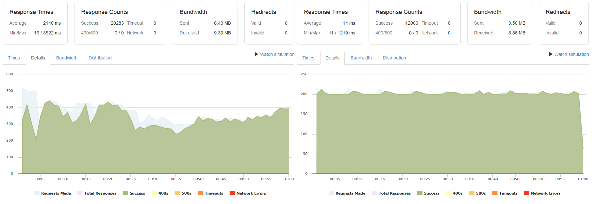
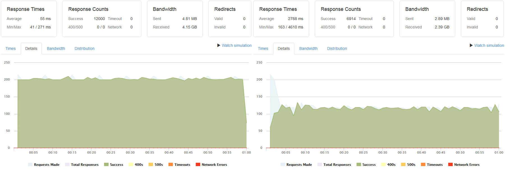

# 
Mobile application for League of Legends players. The goal is to make 
comparing player performance easy.

The project is no longer being maintained and has been taken down due 
to server costs. If you are interested in picking up where I left off, 
email me at tberroa@outlook.com to chat.

# App
### Compare Stats to Friends and Pros

### Break Stats Down By Role and Champion

### Many Different Stats and Customizable Plotting

# Backend
### System Diagram

### Required Libraries
- awsebcli
- boto
- cassiopeia
- django
- pymysql
- python-memcached

### Setting Up For Linux Development
1. Make sure python is installed  
2. Install git: sudo apt-get install git  
3. Clone repo in home directory: git clone http://github.com/tberroa/portal  
4. Install pip: sudo apt-get install python-pip
5. Install python3-dev: sudo apt-get install python3-dev
6. Install virtualenv: sudo pip install virtualenv
7. Create python3 virtual environment in /backend: virtualenv -p python3 myvenv
8. Activate myvenv and pip install requirements: pip install -r requirements.txt
9. Create file /backend/portal/keys.py
10. Create file /backend/worker/keys.py
11. Create log file: sudo touch /var/log/django.log
12. Set up log file permissions: sudo chmod 666 /var/log/django.log
13. Set up AWS Elastic Beanstalk files in /backend/portal: eb init
14. Set up AWS Elastic Beanstalk files in /backend/worker: eb init

# Server & API Tests
### Setup
- EC2 T2.Nano with 8GB SSD x 11
- RDS T2.Micro with 20GB SSD
- ElastiCache T2.Micro
- Elastic Beanstalk Classic Load Balancer

### Apache
At 3000 calls per second, server performance begins to degrade due 
to EC2 nano memory constraints. The server comfortably handles 2000 
calls per second.

### Riot API
When attempting 500 calls per second, the Cassiopeia library properly 
throttles in order to respect the Riot rate limit. The server comfortably 
handles 285 calls per second to the Riot API.

### Database
Database performance begins to degrade at 1000 calls per second but 
comfortably handles 500 calls per second. Operation is a simple SELECT query.

### Login Endpoint
At 500 calls per second, login performance begins to degrade due to hashing 
costs on the EC2 CPU. The server comfortably handles 200 calls per second 
to the login endpoint.

### Get Match Stats Endpoint (for 10 summoners)
At 200 calls per second, get match stats cached performance is very good.
Get match stats non-cached performance at the same 200 calls per second is 
noticeably worse.

### Get Season Stats Endpoint (for 10 summoners)
At 230 calls per second, get season stats cached performance is very good.
Get season stats non-cached performance at the same 230 calls per second is 
noticeably worse.

# License
MIT License

Copyright © 2017 Thomas Berroa

Permission is hereby granted, free of charge, to any person obtaining a copy
of this software and associated documentation files (the "Software"), to deal
in the Software without restriction, including without limitation the rights
to use, copy, modify, merge, publish, distribute, sublicense, and/or sell
copies of the Software, and to permit persons to whom the Software is
furnished to do so, subject to the following conditions:

The above copyright notice and this permission notice shall be included in all
copies or substantial portions of the Software.

THE SOFTWARE IS PROVIDED "AS IS", WITHOUT WARRANTY OF ANY KIND, EXPRESS OR
IMPLIED, INCLUDING BUT NOT LIMITED TO THE WARRANTIES OF MERCHANTABILITY,
FITNESS FOR A PARTICULAR PURPOSE AND NONINFRINGEMENT. IN NO EVENT SHALL THE
AUTHORS OR COPYRIGHT HOLDERS BE LIABLE FOR ANY CLAIM, DAMAGES OR OTHER
LIABILITY, WHETHER IN AN ACTION OF CONTRACT, TORT OR OTHERWISE, ARISING FROM,
OUT OF OR IN CONNECTION WITH THE SOFTWARE OR THE USE OR OTHER DEALINGS IN THE
SOFTWARE.

