# 
Mobile application for League of Legends players. The goal is to make 
comparing player performance easy.

The project is no longer being maintained and has been taken down due 
to server costs. If you are interested in picking up where I left off, 
email me at tberroa@outlook.com to chat.

# App
### Compare Stats to Friends and Pros
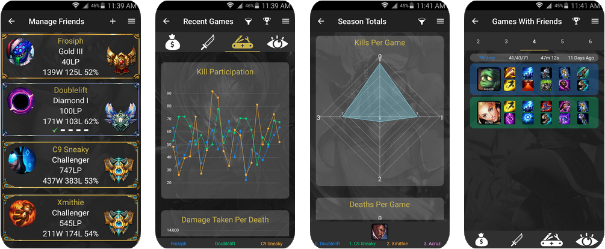

### Break Stats Down By Role and Champion
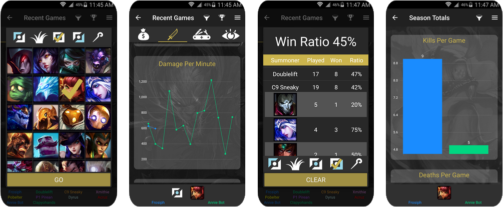

### Many Different Stats and Customizable Plotting
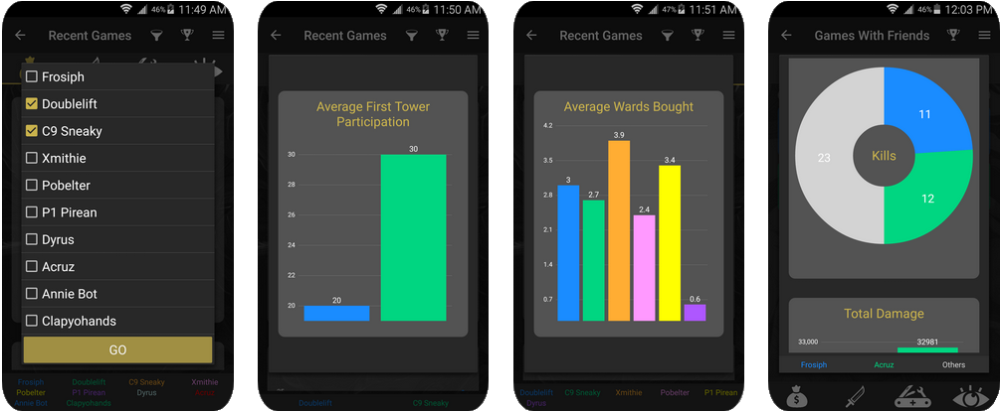

# Backend
### System Diagram
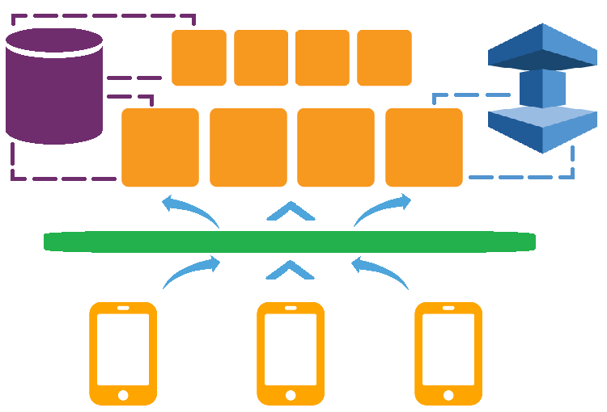

### Required Libraries
- awsebcli
- boto
- cassiopeia
- django
- pymysql
- python-memcached

### Setting Up For Linux Development
1. Make sure python is installed  
2. Install git: sudo apt-get install git  
3. Clone repo in home directory: git clone http://github.com/tberroa/portal  
4. Install pip: sudo apt-get install python-pip
5. Install python3-dev: sudo apt-get install python3-dev
6. Install virtualenv: sudo pip install virtualenv
7. Create python3 virtual environment in /backend: virtualenv -p python3 myvenv
8. Activate myvenv and pip install requirements: pip install -r requirements.txt
9. Create file /backend/portal/keys.py
10. Create file /backend/worker/keys.py
11. Create log file: sudo touch /var/log/django.log
12. Set up log file permissions: sudo chmod 666 /var/log/django.log
13. Set up AWS Elastic Beanstalk files in /backend/portal: eb init
14. Set up AWS Elastic Beanstalk files in /backend/worker: eb init

# Tests
### Server & API Tests
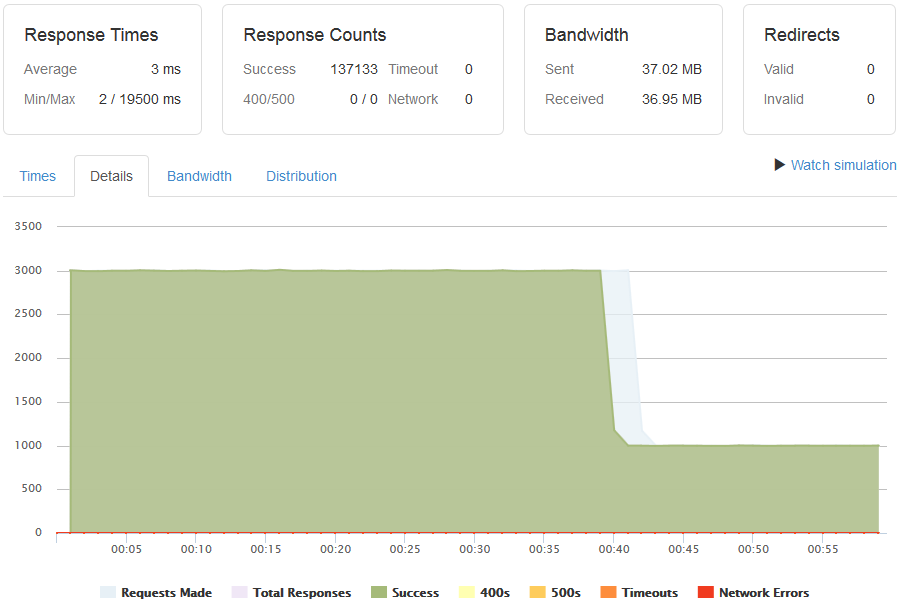
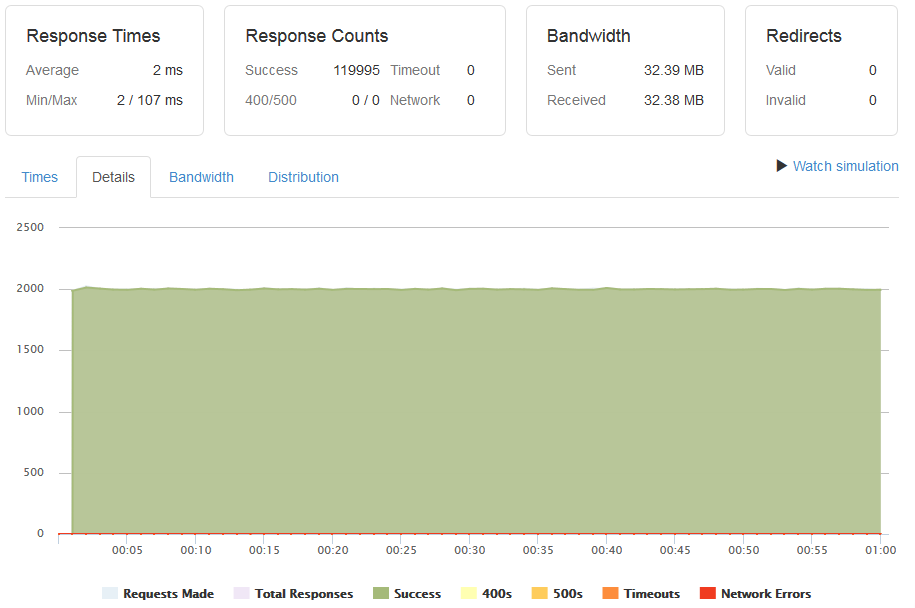

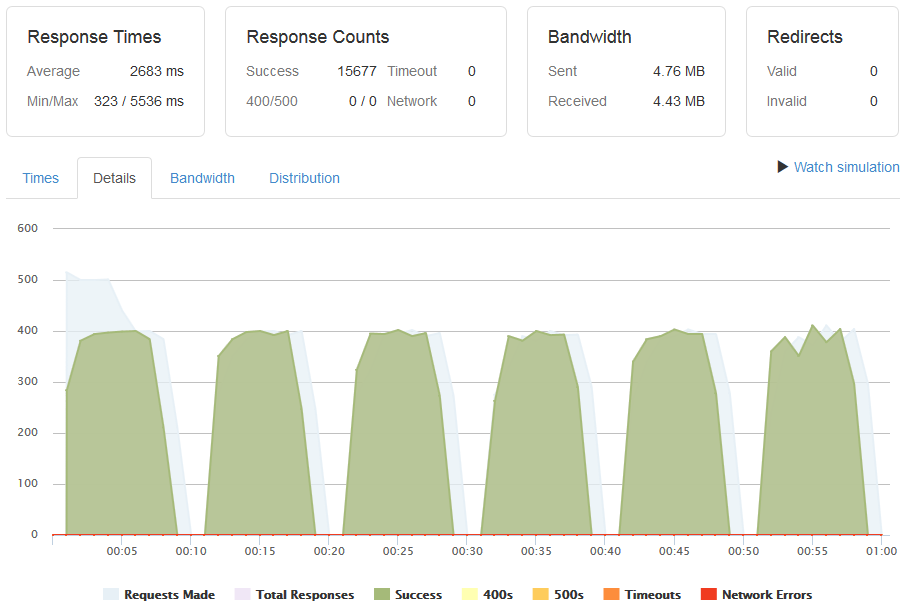
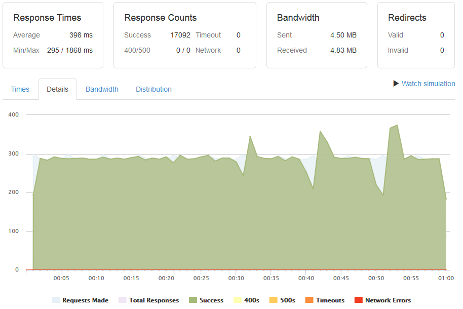

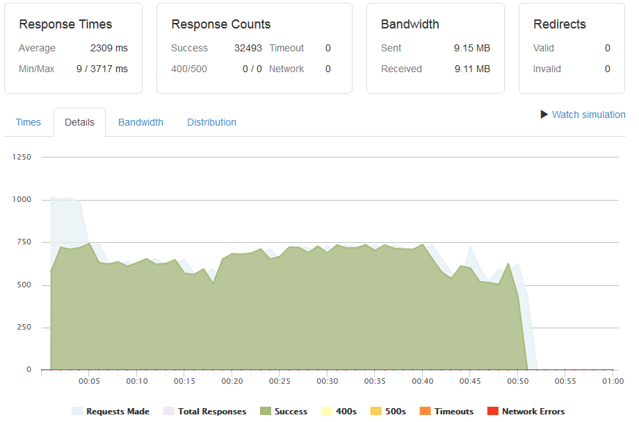
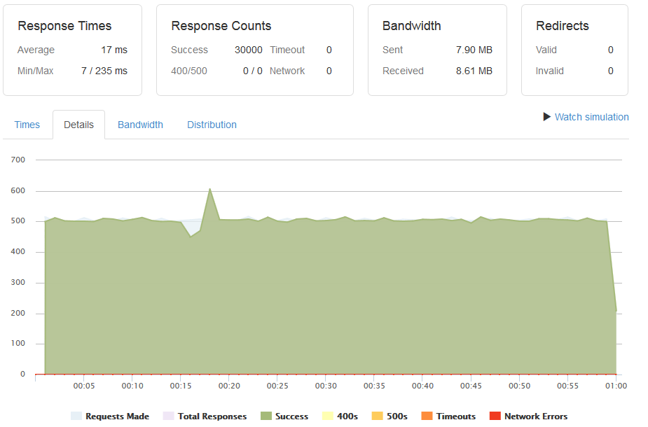

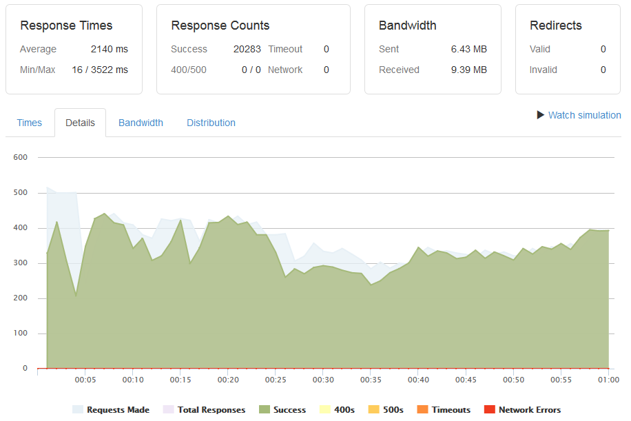
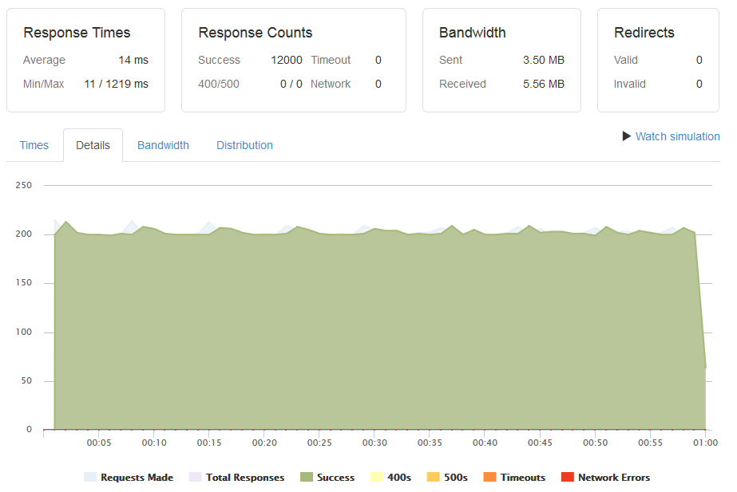

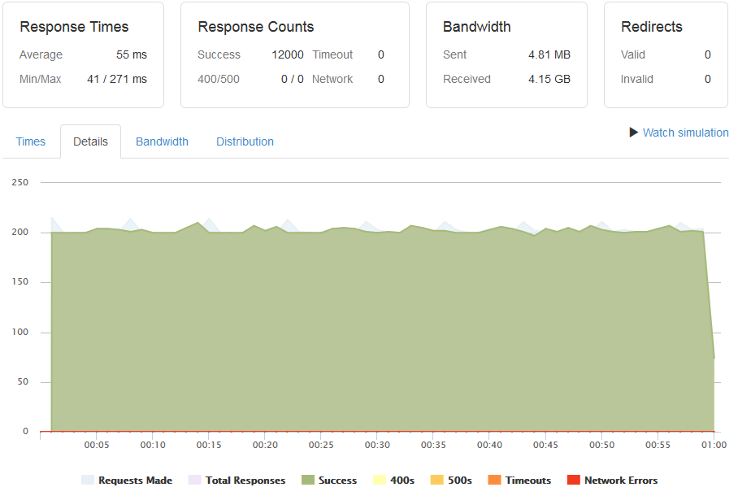
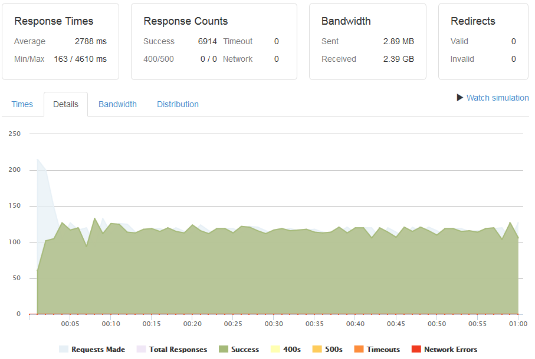

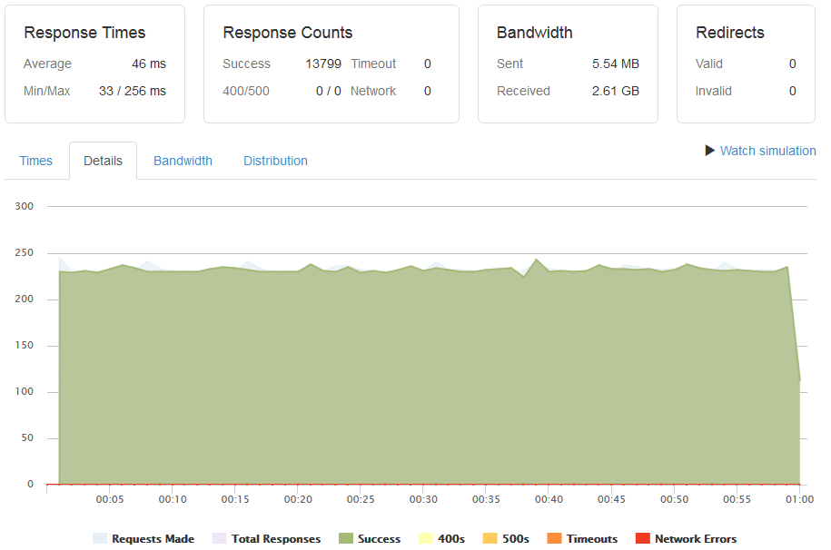
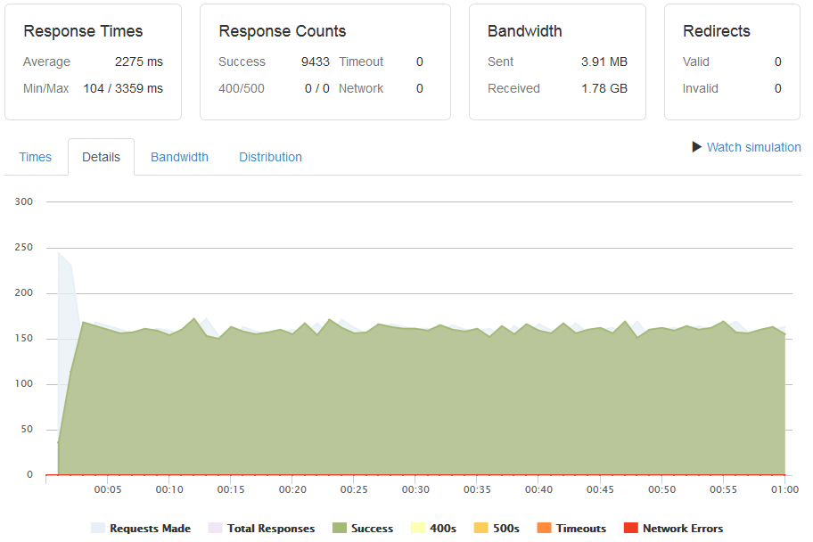

# License
MIT License

Copyright © 2017 Thomas Berroa

Permission is hereby granted, free of charge, to any person obtaining a copy
of this software and associated documentation files (the "Software"), to deal
in the Software without restriction, including without limitation the rights
to use, copy, modify, merge, publish, distribute, sublicense, and/or sell
copies of the Software, and to permit persons to whom the Software is
furnished to do so, subject to the following conditions:

The above copyright notice and this permission notice shall be included in all
copies or substantial portions of the Software.

THE SOFTWARE IS PROVIDED "AS IS", WITHOUT WARRANTY OF ANY KIND, EXPRESS OR
IMPLIED, INCLUDING BUT NOT LIMITED TO THE WARRANTIES OF MERCHANTABILITY,
FITNESS FOR A PARTICULAR PURPOSE AND NONINFRINGEMENT. IN NO EVENT SHALL THE
AUTHORS OR COPYRIGHT HOLDERS BE LIABLE FOR ANY CLAIM, DAMAGES OR OTHER
LIABILITY, WHETHER IN AN ACTION OF CONTRACT, TORT OR OTHERWISE, ARISING FROM,
OUT OF OR IN CONNECTION WITH THE SOFTWARE OR THE USE OR OTHER DEALINGS IN THE
SOFTWARE.

