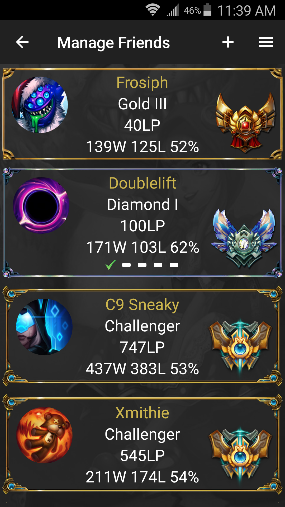
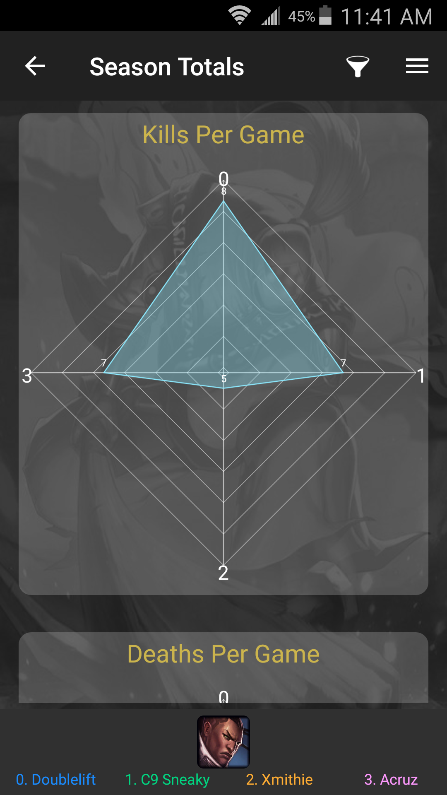
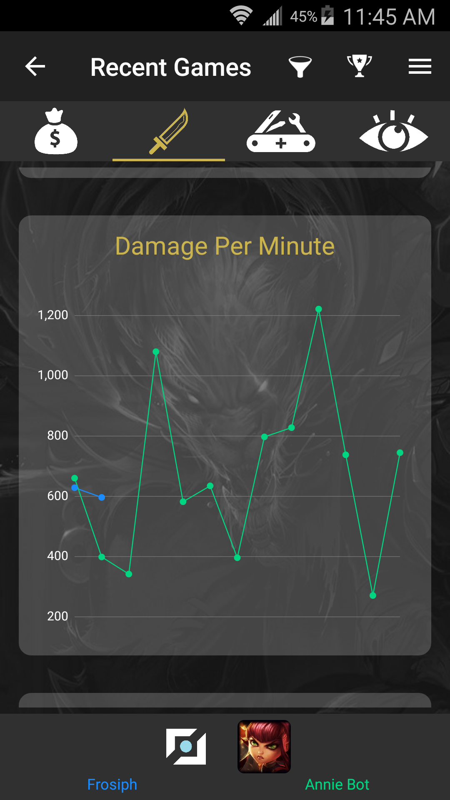
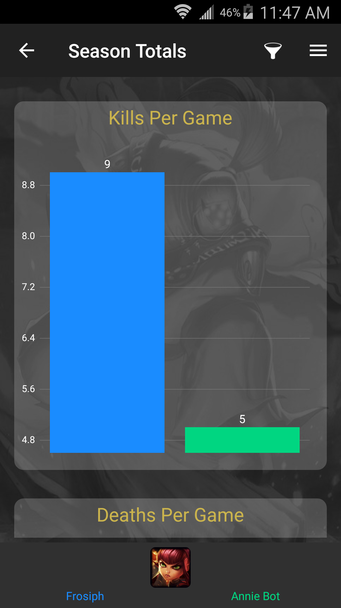
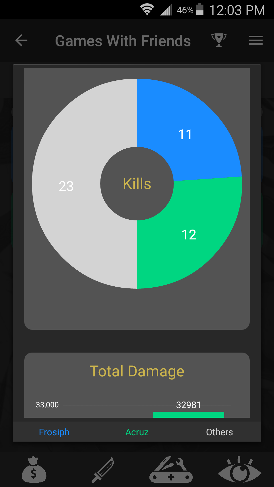
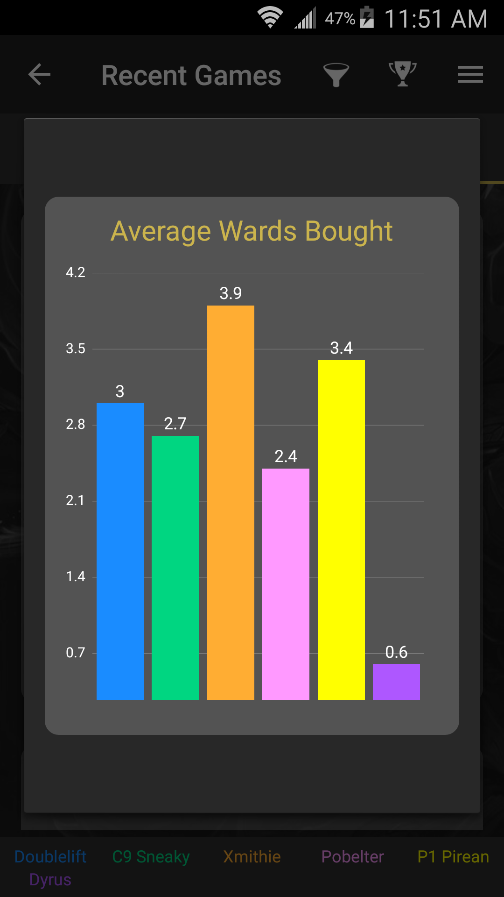

# App Preview
### Compare Stats to Friends and Pros

### Break Stats Down By Role and Champion

### Many Different Stats and Customizable Plotting

# Backend
### System Diagram

### Required Libraries
- awsebcli
- boto
- cassiopeia
- django
- pymysql
- python-memcached

### Setting Up For Linux Development
1. Make sure python is installed  
2. Install git: sudo apt-get install git  
3. Clone repo in home directory: git clone http://github.com/tberroa/portal  
4. Install pip: sudo apt-get install python-pip
5. Install python3-dev: sudo apt-get install python3-dev
6. Install virtualenv: sudo pip install virtualenv
7. Create python3 virtual environment in /backend: virtualenv -p python3 myvenv
8. Activate myvenv and pip install requirements: pip install -r requirements.txt
9. Create file /backend/portal/keys.py
10. Create file /backend/worker/keys.py
11. Create log file: sudo touch /var/log/django.log
12. Set up log file permissions: sudo chmod 666 /var/log/django.log
13. Set up AWS Elastic Beanstalk files in /backend/portal: eb init
14. Set up AWS Elastic Beanstalk files in /backend/worker: eb init

